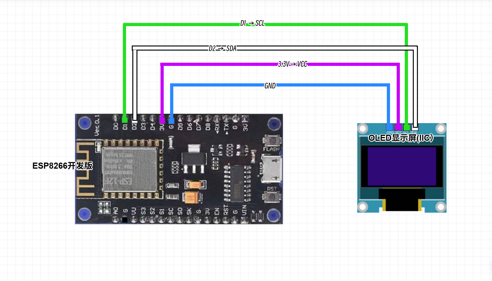
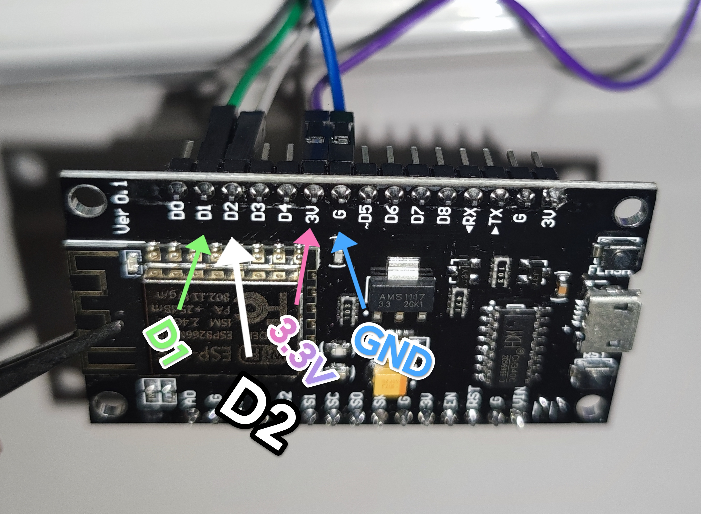
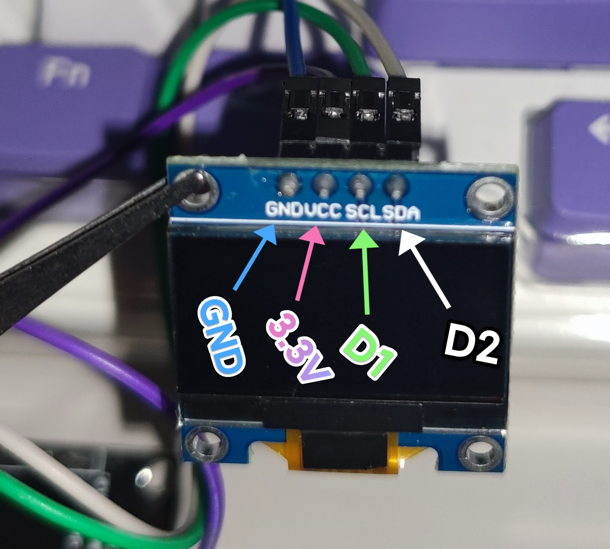

简体中文 | [English](README_EN.md)
# ESP8266 Uptime Kuma 监控器

基于 ESP8266 + OLED 显示屏的轻量级 Uptime Kuma 状态监控器，支持服务状态显示、24 小时在线率，并附带动态时钟与日历、农历功能。

## 功能特点

- **状态展示**：支持展示监控服务名称、实时在线状态（图形化标志 `√`/`×`/`?`）以及 24 小时在线率。
- **万年历时钟**：大号时间显示 + 公历日期星期 + 农历。
- **自动轮播**：两页间 15 秒自动翻页轮播，延长 OLED 屏幕寿命，防止烧屏。
- **高可用设计**：网络自动校时（NTP），带数据缓存与网络异常后备机制。
- **极致稳定**：针对 ESP8266 极小内存（RAM ~80KB）进行深度 JSON 解析优化，拒绝频繁重启。

---
##  项目预览

||||
|:---:|:---:|:---:|
| 开机动画 | Uptime Kuma 监控页 | 时间与农历页 |
---

## 硬件接线

| ESP8266 (NodeMCU/WeMos D1 mini) | 0.96寸 OLED (SSD1306 I2C) |
| :------------------------------ | :------------------------- |
| `3.3V`                          | `VCC`                      |
| `GND`                           | `GND`                      |
| `D2` (GPIO4)                    | `SDA`                      |
| `D1` (GPIO5)                    | `SCL`                      |

### 逻辑连线平面图


### 引脚标注对照图
|||
|:---:|:---:|
| ESP8266 开发板端引脚 | OLED 显示屏端引脚 |
---

## 依赖库与编译环境

> 安装方式：Arduino IDE -> 工具 -> 管理库 -> 搜索并安装对应版本。

| 库名称 / 开发板固件 | 推荐版本 | 说明 |
| :--- | :--- | :--- |
| **ESP8266 开发板库** | `2.7.4` | 开发板管理器中安装（ESP8266 Core） |
| **U8g2** | `2.36.19` | 用于 OLED 图文绘制与点阵字体支持 |
| **ArduinoJson** | `7.2.0` | **必须使用 V7 版本**（代码基于 V7 语法编写，V6 不兼容） |

---

## 如何配置状态页与获取监控 ID (`monitorIds`)？

在配置代码前，需要先在 Uptime Kuma 中创建公开状态页，并提取监控项的 ID。

### 第一步：在 Uptime Kuma 中创建状态页
1. 登录你的 **Uptime Kuma** 管理后台。
2. 点击顶部导航栏的 **“状态页面” (Status Page)** -> 点击 **“添加新的状态页”**。
3. 填写标题并设置路径 Slug 。
4. 在页面编辑区点击 **“添加监控项”**，选入你需要展示的服务（**建议最多添加 3 个**）。
5. 点击右下角 **“保存”**。


### 第二步：提取监控项 ID (`monitorIds`) 与名称 (`monitorNames`)
1. 创建完成后，打开终端运行 `curl` 命令（或直接在浏览器访问 API 链接）：

```bash
curl -k https://your-domain.com/api/status-page/heartbeat/your-slug
```

2. 在返回的 JSON 数据中，找到 `publicGroupList` -> `monitorList` 节点，可以看到你添加的监控项列表及其对应的` id `与` name `：

```json
举例

"monitorList": [
  {"id": 4, "name": "Blog1", ...},
  {"id": 3, "name": "Blog2", ...},
  {"id": 5, "name": "Blog3", ...}
]
```
3. 将提取到的 `数字 ID` 填入代码的 `monitorIds`，将对应的 `名称`（仅支持填写英文或数字）填入 `monitorNames` 即可：

```cpp
举例

const char* monitorIds[MONITOR_COUNT]   = {"4", "3", "5"};
const char* monitorNames[MONITOR_COUNT] = {"Blog1", "Blog2", "Blog3"};
```
---

### 聚合数据 Key 获取方法

1. 访问 [聚合数据](https://www.juhe.cn) 注册账号，并实名认证。
2. 搜索“生辰助手”，申请 API。
3. 在“我的 API”中找到 AppKey，填入代码。

> 为什么用聚合数据？<br>因为当时测试随手选了这个，测试一遍过，懒得再去注册别的平台。
---

## 配置与烧录

在将代码烧录进 ESP8266 之前，需要根据你的个人环境修改代码开头的 **`用户配置区`**：

```cpp
// ========== 用户配置区 ==========
const char* ssid = "YOUR_WIFI_SSID";           // 填写 2.4G WiFi 名称
const char* password = "YOUR_WIFI_PASSWORD";   // 输入 WiFi 密码
const char* JUHE_KEY = "YOUR_JUHE_KEY";        // 填写聚合数据 API Key
const char* STATUS_API = "https://your-domain.com/api/status-page/heartbeat/your-slug"; // Uptime Kuma 状态页 API

// 监控列表（最多建议 3 个，超出屏幕放不下）
const int MONITOR_COUNT = 3;
const char* monitorIds[MONITOR_COUNT]   = {"4", "3", "5"};       // Uptime Kuma 对应的监控项 ID
const char* monitorNames[MONITOR_COUNT] = {"Blog1", "Blog2", "Blog3"}; // 显示在 OLED 屏幕上的名称（修改成你的监控项名字，仅限英文或数字）
// ================================

```


## 为什么监控项是硬编码的？

**为了最大限度节省 ESP8266 宝贵的 RAM（约 80KB）**。动态获取监控列表需要额外 HTTP 请求和 JSON 解析，容易导致内存不足或程序崩溃。本设计固定 3 个监控项，稳定可靠。

## 注意事项

- 不支持中文监控名称（仅“农历月”三个字为点阵绘制，其余均为英文/数字）。
- 最多显示 3 个监控项，如需更多，需自行修改代码（但可能超出屏幕或内存）。

## 开源协议

本项目采用 [GPLv3](LICENSE) 开源协议。

欢迎个人学习与技术交流。**任何基于本项目的二次开发、衍生作品或商业分发，必须保持开源并同样使用 GPLv3 协议发布。**
